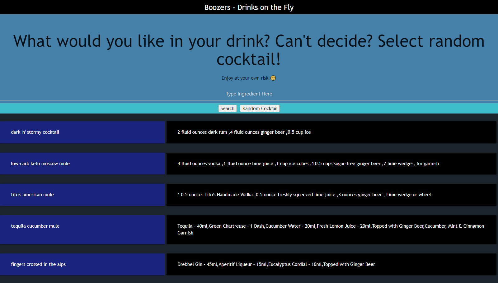

<h1 align="center"><project-name>Drink When Thirsty</h1>

<project-description>A responsive application where you can search for cocktails by ingredient or select a random cocktail. The purpose of this application is to solve the indecisiveness of drink choice. Users are able to discover hundred of new drinks or go with something they are more familiar with.

## Links

- [Repo](https://github.com/mmeyer715/drink-when-thirsty> "<project-name> Drink When Thirsty")

- [Live](<Homepage url> "https://mmeyer715.github.io/drink-when-thirsty/")

- [API](<API Link> "https://rapidapi.com/Bmbus/api/cocktails3/")

## Screenshots

## Built With

- HTML
- CSS
- JavaScript
- jQuery
- API Calls
- Materialize/MUI
- Local Storage

## Future Updates

- Age Verification
- User sign up, to save their favorite drinks or make suggestions
- Recommended daily beverages

## Author

**Maria Bean**
**Jack Frison**
**Onyeka Nnajiego**

- [Profile](https://github.com/mmeyer715/drink-when-thirsty "Maria Bean")
- [Email](mailto:rohitjain19060@gmail.com?subject=Hi "Hi!")
- [Website](https://mmeyer715.github.io/drink-when-thirsty "Welcome")

## 🤝 Support

Contributions, issues, and feature requests are welcome!

Give a ⭐️ if you like this project!